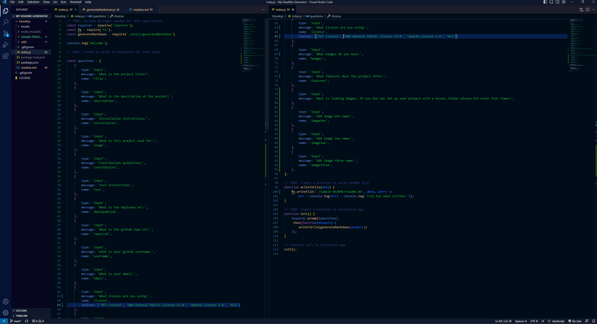
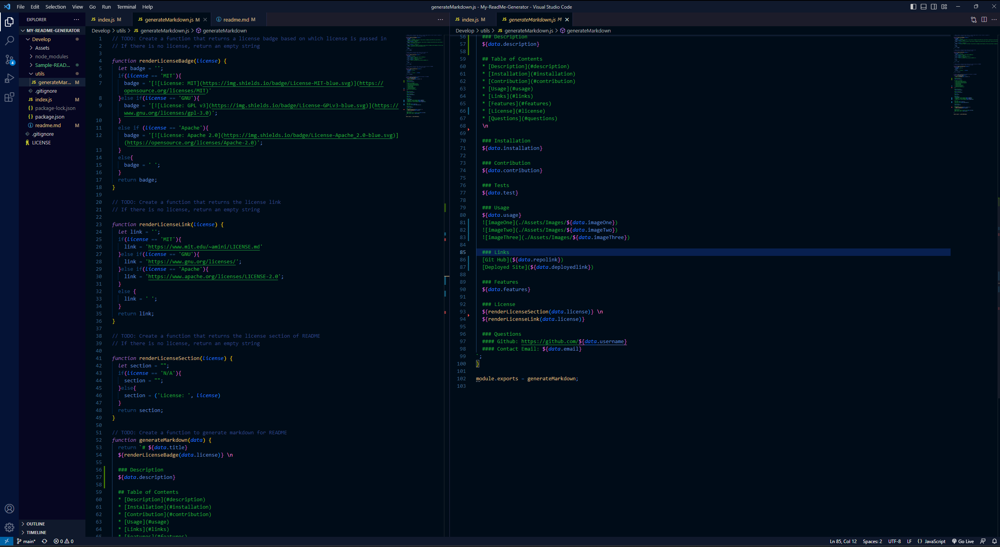
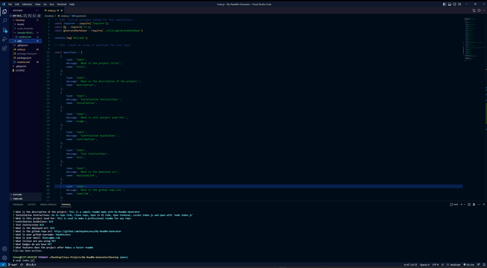

# My-ReadMe-Generator
    
  ### Description
  On this project I made a readme generator to quickly make a readme for any project that you are working on.

  ## Table of Contents
  * [Description](#description)
  * [Installation](#installation)
  * [Contribution](#contribution)
  * [Usage](#usage)
  * [Links](#links)
  * [Features](#features)
  * [License](#license)
  * [Questions](#questions)
  
  ### Installation
  Required is node.js! (https://nodejs.org/en)
  Clone repo liked below in readme. 
  Open terminal and locate index.js. 
  Run comand 'node index.js' once running fallow prompts.

  ### Contribution
  N/A

  ### Tests
  N/A
 
  ### Usage 
  Once installation is complete and prompts are showing fill out info.
  Promts will start with the description and end with features.
  If anything from the table of contents does not apply it can be left blank or write in N/A.
  Also available is adding images in the usage area.
  To do this please set up an Assets and Images folder in your project to link the images.
  Image link in code is ../Assets/Images/IMAGE-NAME-HERE.FILE
  
  
  

  ### Links
  [Github](https://github.com/HaydenLenca/My-ReadMe-Generator) 
  
  [Deployed Site]()

  ### Features
  License and badges offered; MIT, GNU and Apache.

  ### License 
   MIT

  
   

  ### Questions 
  Please reach out to me at either Github or email with any questions.
  #### Github: https://github.com/HaydenLenca
  #### Contact Email: Hlenca@me.com
